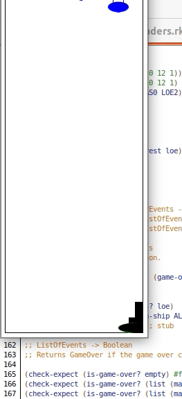

# Space Invaders :alien:

This is a Racket implementation of a version of a Space Invaders game. This project is intended as a learning tool for the course `How to Code: Simple Data`.

You can find domain analysis for this game in  [Domain Analysis](./space_invaders.pdf) document.

## Installation

- You need to install https://racket-lang.org/download/
- Open `space-invaders.rkt` and run it with Dr.Racket

## Gameplay

